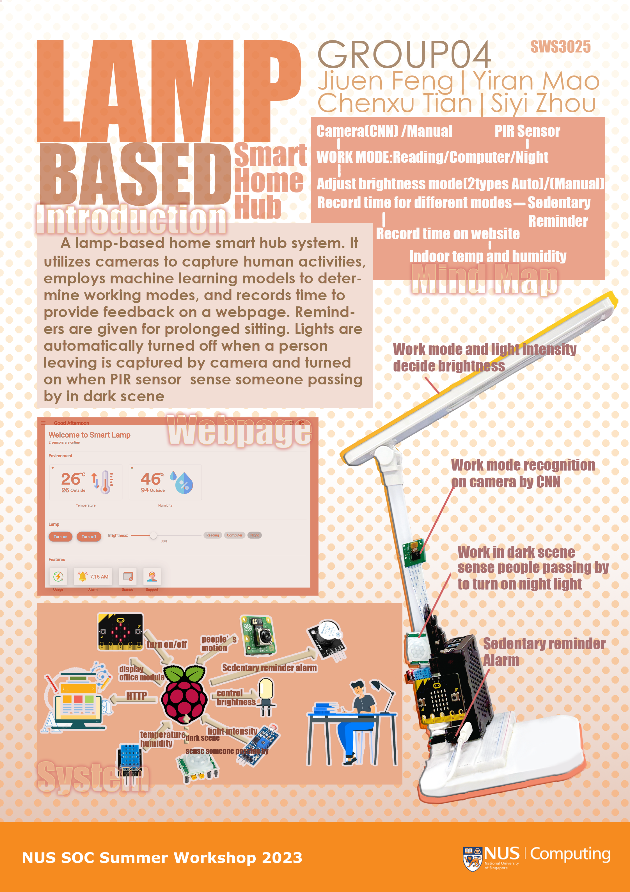

# SWS3025_AIoT_Project
AIoT project for SWS3025, NUS School of Computing Summer Workshop 2023



## Description of Problem

Optimizing lighting conditions is crucial for energy efficiency, with excessive lighting and the habit of leaving lights on causing unnecessary waste. 

To ensure visual comfort during work, it is important to address the issue of fixed brightness in some desk lamps, which can lead to eye discomfort due to environmental changes. For nighttime safety, the automatic activation of night lights is necessary to prevent accidents when moving in the dark. 

To mitigate the negative impact of prolonged sitting on physical health, reminders are needed to encourage breaks and posture adjustments. Time management is another aspect that needs attention, as individuals often forget to pay attention to their computer usage or reading time. 

Finally, an integrated system displaying indoor temperature and humidity levels can provide valuable insights and suggestions for optimizing comfort and energy efficiency.

## Description of Proposed Solution

We propose a lamp-based home smart hub system to address the aforementioned issues. The proposed system incorporates various features to enhance user experience and optimize the indoor environment. It utilizes cameras to capture human activities, employs machine learning models to determine working modes, and records time to provide feedback on a webpage. Reminders are given for prolonged sitting or incorrect sitting posture, and lights are automatically turned off when a person leaving is captured by camera. 
Facial recognition is used to achieve personalized lightness variation, and a light intensity sensor facilitates brightness adjustment within the desired range based on working modes. The system also utilizes a PIR sensor to automatically turn on lights in dark environments when human activity is detected. The frontend webpage offers a user-friendly dashboard with real-time updates on temperature and humidity conditions, along with environment-based suggestions. Additionally, the webpage allows manual lightness adjustment to cater to individual preferences.

## Run web server
On Raspberry Pi, run the following commands:
```
cd project
authbind --deep python main.py
```
